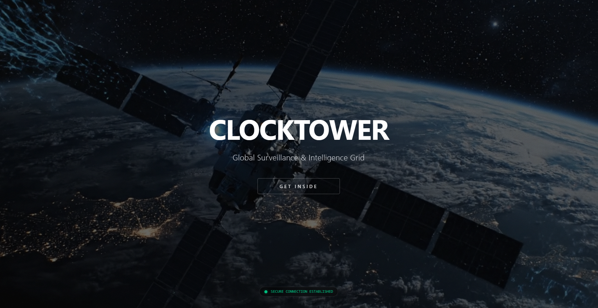
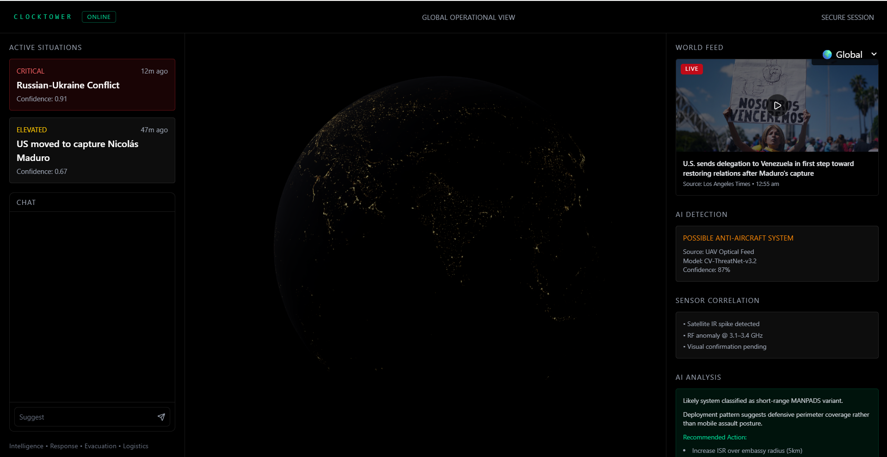
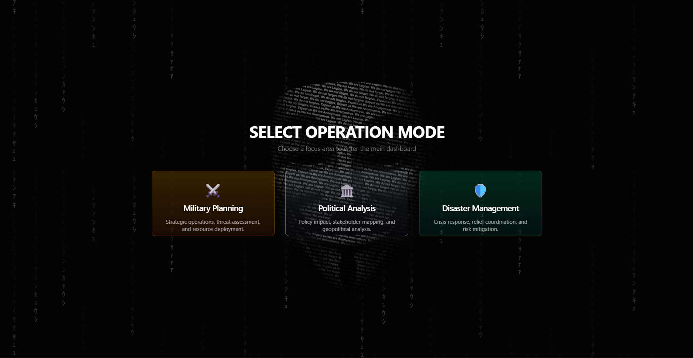

  

<h1 align="center">Clocktower Systems</h1>

**Clocktower Systems** is surveillance and monitoring software which will help organizations to make decisions rapidly.

**System Overview**

**Multi Operation modes**

What are the developments going on currently ?

- Building Decentralized Identity for users 
- End-to-End encryption message window
- Matrix style federation for decentralized messaging layer
- Latency spike graph and packet loss bursts
- Tunneling

March 2,2026 - March 8, 2026
- Scaling websockets  using Azure Container Apps

With the above features Real-time  decison making engine is in progress.

For all the updates related to ClockTower System follow [Vivek Sharma](https://www.linkedin.com/in/vivekuchiha/)

Hang on for more updates !
